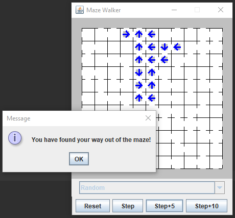

# MazeWalker
This is an example program used in a Java programming course.  which can be used to highlight  the following topics:
* 2 dimensional arrays (of objects)
* The JavaX Swing graphics library (with button interaction)
* Inheritance and abstract data types
* Introduction to artificial intelligence

This is a program that will draw a graphic depiction of an avatar (maze walker) attempting to find its way out of 
the maze. The size of the maze is determined by user input and the maze is created randomly and may have more
one exit. Each time the user click one of the "step" buttons, the walker will advance towards its goal. The last
direction taken is shown as an arrow in rooms that have been previously visited. There are multiple
types of walkers. Each tries to solve the maze using different techniques. Users select the walker they want 
to attempt the maze by choosing one of the dropdown list before choosing a step. Full instructions are 
below.

## Instructions of use
* Select the number of rooms to appear in the maze (the maze will be a square with the given size as the 
number of rows and columns in the maze).
* Select the maze walker from the drop-down list. Once chosen the a new walker cannot be selected until
a new maze is created. The walker will appear at the center of the maze.
* Press one of the three step buttons to advance the walker thought the maze. The walker may choose to move 
in one of 5 directions: None, Up, Right, Down, or Left. Each walker makes this selection differently. A step may be
blocked by a wall or None may be selected, so no movement may be seen in a step.
	* Step: advances the walker one time. 
	* Step+5: advances the walker five times. 
	* Step+10: advances the walker ten times.
* When the walker reaches the outside edge of the maze, then they have found their way out of the maze and
the step buttons will be disabled. A pop-up message will indicate this success. 
	Note: Some walkers may become lost in the maze and may never find their way out!
* Press reset to generate a new maze and place the walker back at the center. Go back to step 2 and repeat 
as many times as desired.
* Press the close window button ("X" in the right-corner for Windows) to end the program.

All code presented here is for educational purposes only and does not knowingly contain any solutions
to labs, exams, or other assignments for any course. Feel free to use this code for your own
courses, self-instruction, or personal use but please retain the attribution to this source.

Ken Loomis